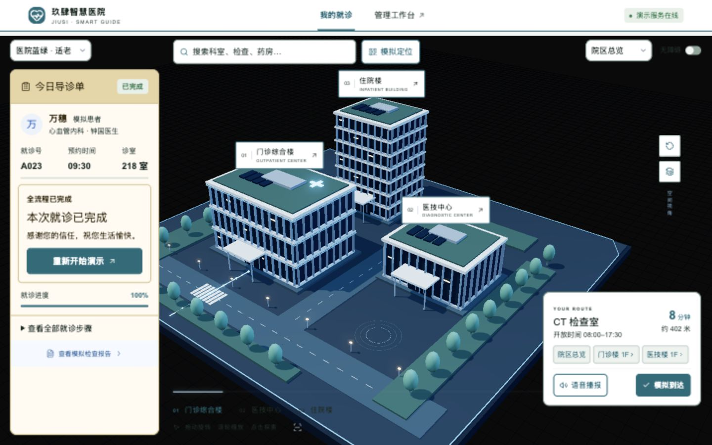
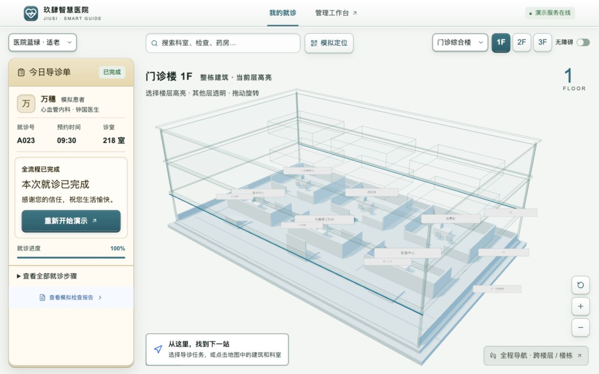
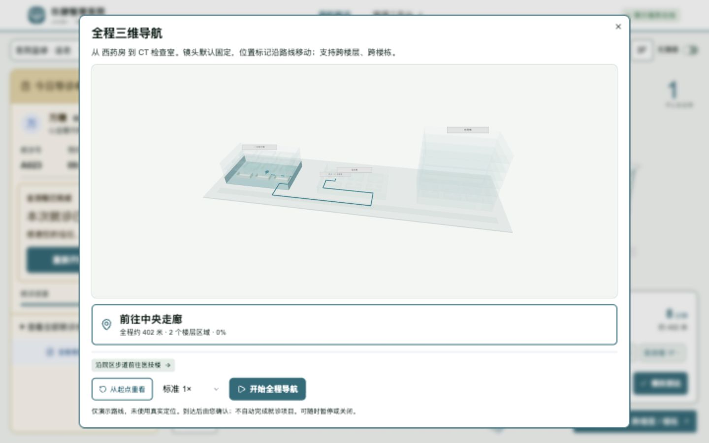
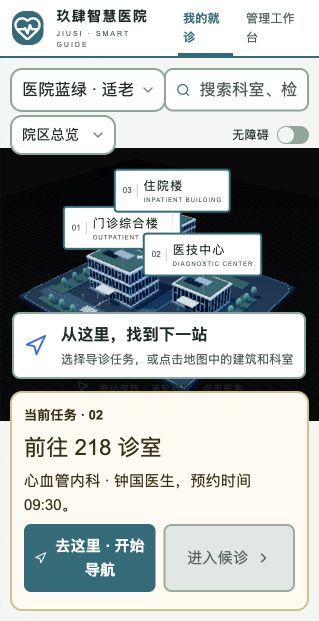
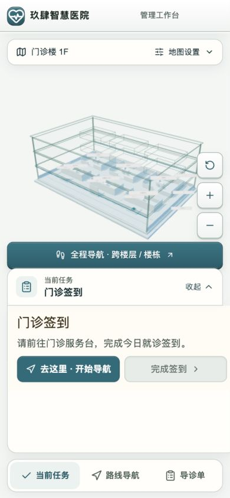
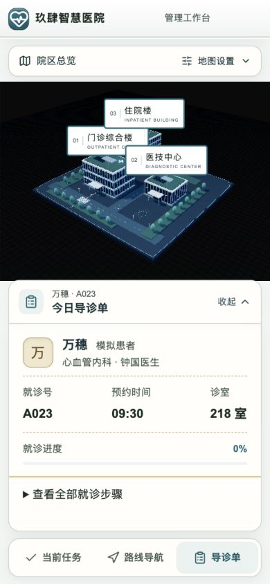

<div align="center">

# 🏥 SmartGuide · 玖肆智慧医院

**把一张导诊单，变成看得懂的三维就诊路线。**

三维院区 · 跨楼导航 · 适老拟物界面 · 模拟就诊流程

**源码可见 · 非商业使用免费 · 商用需书面许可**

[](https://github.com/94van/smartguide-94/actions/workflows/ci.yml)
[](LICENSE)

[观看导览](#-24-秒界面导览) · [本地启动](#-本地启动) · [开发文档](docs/DEVELOPMENT.md) · [反馈问题](https://github.com/94van/smartguide-94/issues)

</div>



> **仅供模拟演示。** 玖肆智慧医院、医生钟国、患者万穗均为演示标签；不提供真实医疗服务，请勿输入真实患者信息。截图来自实际运行界面，建筑与路线为虚构示意。

## 🎬 24 秒界面导览

**视频已提供，无需另行制作即可查看项目外观。** 使用本次重新采集的 **0.2.1 实际界面**，展示桌面院区、室内导诊、跨楼路线，以及手机收起状态、路线面板与导诊单。

[▶ 观看 / 下载 MP4 导览视频](https://github.com/94van/smartguide-94/raw/refs/heads/main/docs/media/screenshot-tour.mp4)

这是实际界面的**截图导览视频**，无音频，不是连续操作录屏，也不展示完整就诊操作。GitHub 若未内嵌播放，可点击链接下载观看；想实际体验旋转建筑、选层和导航，请按下方步骤本地启动。

| 时间 | 展示内容 |
| --- | --- |
| 00:00–00:04 | 桌面三维院区总览 |
| 00:04–00:08 | 桌面楼内导诊工作区 |
| 00:08–00:12 | 桌面全程三维导航 |
| 00:12–00:16 | 手机院区：状态卡收起 |
| 00:16–00:20 | 手机路线面板 |
| 00:20–00:24 | 手机导诊单 |

[查看演示脚本与素材说明](docs/DEMO.md)

## ✨ 0.2.2 目的地与便民导航

- 新增“去哪儿”入口，通过就诊 / 检查、便民设施、停车、医生分类按钮选择目的地。
- 增加母婴室、护士台、手机充电点、自动贩卖机和户外停车场人行入口；厕所也可通过预设直接选择。
- 医生卡展示钟国的模拟科室、诊室和排班，并可一键导航。
- 地面路线增加方向箭头；院区和楼内地图可按按钮切换俯视、恢复立体视角。
- 户外停车仅提供步行导航，不含实时车位或驾驶导航；地下车库尚未建模。

19 项自动测试、类型检查和生产构建通过。**下方图片和视频仍记录 0.2.1，不包含本轮新增功能。**

## ✨ 0.2.1 交互更新

- 所有主题默认打开院区总览；手机启动时取消自动飞入镜头。
- 双击建筑名称，经过轻亮确认和平稳靠近后进入对应楼栋 1F；手机连续双击、键盘回车均可使用。
- 手机顶部设置、底部状态卡均可点按展开 / 收起；卡片、箭头和地图空间使用连续减速过渡。
- 候诊卡增加“跳过等待（演示）”，叫到 A023 后仍需手动点击接诊。
- 修正手机院区画布高度、深色图标对比及局域网启动参数。

这些更新已通过类型检查、构建和相关测试。下方图片和视频均已按 **0.2.1** 重新采集制作，桌面视口为 1440 × 900，手机视口为 390 × 844；这是浏览器响应式展示，不等同于全面手机真机验收。[完整变更记录](docs/CHANGELOG.md)

## 🧭 从院区到诊室，一条路线看清楚

| 能力 | 实际交互 |
| --- | --- |
| 三维院区与整栋选层 | 旋转、缩放建筑；选中楼层实体高亮，其他楼层透明显示 |
| 一次规划跨楼路线 | 连接走廊、电梯 / 楼梯、建筑入口与院区步道 |
| 按通行路网行走 | 科室入口、门洞与转角共享路线数据，避免轨迹穿房间或斜切拐角 |
| 减少导航眩晕 | 全程导航默认固定镜头，位置标记移动；支持暂停、重看与速度切换 |
| 模拟完整就诊 | 签到 → 候诊 → 接诊 → 缴费 → 检查 → 报告 → 复诊 → 取药 |
| 通行变化反馈 | 电梯停运、封路、无障碍模式参与路线计算；不可达时明确提示 |



主工作区把建筑、导诊单与下一步操作放在同一屏；完整步骤在面板内展开。小屏采用响应式布局。



全程导航只演示路线，不自动修改患者位置或完成任务；结束后需要明确确认“模拟到达”。

## ♿ 熟悉、清楚、有反馈

0.2.0 增加实体按键、纸卡压边和内凹信息槽。手机底部通过“当前任务 / 路线导航 / 我的导诊单”切换面板，避免卡片叠压地图；高对比主题保留平整大字样式。设计为项目原创实现，不使用锤子品牌图标或系统素材。


- **医院蓝绿**：默认医疗色主按钮，配暖米白导诊单；操作靠文字和形状辨认。
- **高对比大字**：白底深字、大按钮；另提供空间展示主题。
- **完成有提示**：每一步完成显示确认卡和下一步，最后显示庆祝卡与彩带。
- **错误不含糊**：红字、红边框持续警示；普通提醒使用琥珀色。
- **动态可克制**：尊重减少动态效果偏好；庆祝无声音、无频闪，可关闭。

### 手机端实际界面

<table>
<tr><td align="center">院区总览 · 收起状态</td><td align="center">路线面板</td></tr>
<tr><td></td><td></td></tr>
<tr><td align="center">当前任务</td><td align="center">我的导诊单</td></tr>
<tr><td></td><td></td></tr>
</table>

[查看手机全程导航截图](docs/media/mobile-journey.png)

## 🚀 本地启动

需要 **Node.js 22.13+、pnpm 11**。

```bash
git clone https://github.com/94van/smartguide-94.git
cd smartguide-94
pnpm install --frozen-lockfile
pnpm dev
```

| 入口 | 地址 |
| --- | --- |
| 患者端 | http://localhost:5173 |
| 管理后台 | http://localhost:5173/admin |
| 模拟接口健康检查 | http://localhost:3000/api/health |

按 `Ctrl+C` 一起停止网页和接口。模拟数据保存在本地 `data/demo.json`，重启后保留。首次体验建议先浏览院区，再按导诊单推进流程。

**技术栈**：React 19 · TypeScript · Three.js · Vinext / Vite · Node.js 模拟 API · 原生微信小程序源码。

## 🛠️ 开发与验证

```bash
pnpm test
pnpm exec tsc --noEmit
pnpm build
pnpm release:check
```

- [开发说明：目录、接口、路网替换、小程序与 Docker](docs/DEVELOPMENT.md)
- [3–5 分钟完整演示脚本](docs/DEMO.md)
- [安全边界](SECURITY.md) · [已知依赖风险](docs/DEPENDENCY_SECURITY.md)
- [贡献说明](CONTRIBUTING.md) · [发布检查](docs/OPEN_SOURCE.md)

**当前边界**：这是本地模拟器，不是可直接上线的医院系统。后台无登录鉴权，未接入真实 HIS、支付或定位；不要直接暴露到公网。建筑不是 BIM 或实测地图。小程序真机、Docker 和全面无障碍验收尚未完成。截图证明对应界面可呈现，不代表所有设备和流程均已验收。

## 📄 许可与来源

从 **0.2.0** 起，使用 **[SmartGuide 非商业使用许可 1.0](LICENSE)**：非商业使用免费，商用需事先书面许可，禁止未经授权商用。此模式为源码可见，不属于 OSI 定义的开源。此前按 AGPL 发布的版本保留原授权；第三方许可不变。[商业授权方式及历史版本边界](docs/COMMERCIAL_USE.md)。

署名 **94**。源码、页面与场景包含静态来源标记 `94-smartguide-jiusi-2026`；无访客追踪或隐蔽回传，不能阻止复制，也不构成版权权属证明。

[来源声明](NOTICE) · [免责声明](DISCLAIMER.md) · [第三方许可](THIRD_PARTY_NOTICES.md)
